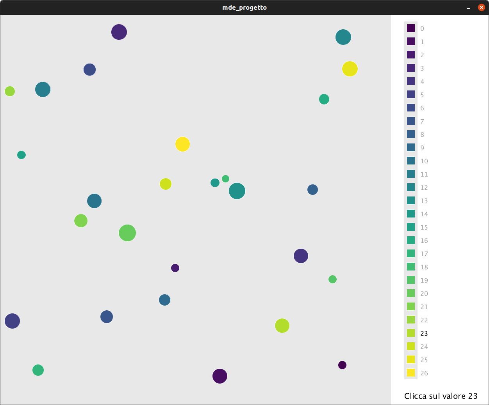

# Introduzione

La visualizzazione è un aspetto fondamentale quando si vogliono presentare dei dati ad un pubblico al fine di comunicare delle relazioni complesse in modo semplice. Hans Rosling fu un pioniere della data visualization, nelle sue presentazioni era solito usare dei plot per illustrare e discutere questioni legate allo sviluppo umano nei Paesi del mondo. Tra le visualizzazioni da egli rese celebri vi sono i bubble plot, in questi i dati sono rappresentati da punti, di dimensione e colore variabile, posizionati su un piano cartesiano. Le dimensioni visuali di ogni punto rappresentano le variabili di un'osservazione e per mostrarne l'evoluzione nel tempo si possono impiegare dei bubble plot animati.

Queste visualizzazioni sono intrinsecamente molto efficaci nel comunicare le informazioni espresse nei dati, sono pensate per contribuire ad una visione di insieme. Per questa loro natura può risultare difficile seguire un singolo punto nel suo percorso sul piano, a meno di non introdurre un highlight di qualche tipo.

In questo progetto abbiamo investigato i possibili vantaggi provenienti dall'impiego del suono per evidenziare un punto in un bubble plot animato. Noi abbiamo ipotizzato che la sonificazione possa aiutare ad individuare e seguire un punto di riferimento nel grafico.

# Metodo

Per trattare questa ipotesi abbiamo realizzato una simulazione in Processing di un bubble plot animato, con la possibilità di riprodurre un highlight sonoro. Le scene realizzate con questa simulazione sono state impiegate per svolgere degli esperimenti con dei soggetti, al fine di valutare gli effetti della sonification nel task di individuazione di un punto.

## Rappresentazione visuale

Per ciascuna scena simulata sono stati generati dei punti che si muovono all'interno di un'area quadrata. La dimensione di un punto è generata in modo casuale all'interno di un intervallo di valori, mentre il colore è ricavato dalla mappa di colore Viridis, in modo che ad ogni punto corrisponda uno specifico colore.

{width=45%}

La scelta della scala Viridis è stata dettata principalmente dalle sue caratteristiche: robustezza, uniformità e popolarità. Il numero dei punti (e di conseguenza dei colori) è stato scelto in modo da rendere non immediata la distinzione dei punti dal colore simile. Abbiamo impiegato un numero di campioni sufficiente ad introdurre una certa confusione tra i colori, pur permettendo la discriminazione dell'obiettivo mediante la sola componente cromatica. Dopo un certo numero di prove preliminari abbiamo individuato in 27 punti un buon compromesso.

Abbiamo affiancato all'area quadrata una legenda per simulare quanto rappresentato nei bubble plot. In questa legenda è resa nota la corrispondenza tra l'etichetta ed il colore. Le etichette consistono di semplici numeri incrementali che partono da zero, mentre i colori corrispondono alla sequenza dei campioni ricavati dalla mappa di colore, in ordine crescente di brightness.

Per ogni scena è estratto in maniera random un punto che funge da target, ovvero il punto sul quale vorremmo che fosse rivolta l'attenzione. Esso è reso noto tramite un'istruzione posta sotto la legenda.

## Sonification

Trattandosi di un bubble plot animato, la scelta sulla proprietà da sonificare è ricaduta sulla velocità del target: il suono è generato a partire da un accordo il cui pitch sale al crescere della velocità del target (ad un punto fermo corrisponde un accordo di Do maggiore, con fondamentale a 32.7 Hz). Per una data velocità ricaviamo un offset che è usato come coefficiente da moltiplicare alle frequenze di base dell'accordo, in modo da spaziare all'interno di un'ottava. La mappatura velocità-pitch è il risultato di una serie di prove preliminari alla ricerca di una buona rappresentatività del suono.

Il suono è stato sintetizzato impiegando degli oscillatori sinusoidali, il segnale risultante è filtrato con un filtro passa basso la cui frequenza di taglio è ricavata dalla velocità del target: ad una bassa velocità corrisponde un suono poco brillante, ad un'alta velocità corrisponde un suono più brillante. Agli oscillatori abbiamo aggiunto un leggero pink noise di fondo per garantire una gamma di frequenze abbastanza vasta, al fine di apprezzare bene le variazioni in brillantezza del suono. Questa sintesi sonora prende spunto da quanto fatto da Niklas Rönnberg [2].

Abbiamo anche realizzato una variazione di questa sonificazione, che funziona esattamente come prima per quanto riguarda la velocità, ma che introduce un leggero suono di "bounce" in caso di variazioni drastiche della traiettoria del punto.

## Movimento

Il moto di ciascun punto è casuale, ma è strutturato in modo che in un intervallo di tempo circoscritto ricalchi un movimento plausibile per un elemento in un bubble plot animato. I punti sono trattenuti all'interno del box, in caso di avvicinamento e contatto con i bordi le traiettorie sono deviate per mantenere i punti entro i limiti. A queste variazioni di direzione non corrisponde un bounce in quanto si tratta di variazioni artificiali che non si presentano nei bubble plot, la loro sonificazione potrebbe risultare fuorviante.

## Partecipanti

Ai nostri esperimenti hanno preso parte 21 partecipanti (8 femmine e 13 maschi), con un'età mediana di 23 anni (range 13-34), con normali capacità di vista e udito. I partecipanti erano tutti nostri conoscenti. Non è stato fornito alcun compenso per la partecipazione allo studio.

## Esperimenti

Abbiamo eseguito diverse sessioni di esperimenti, cercando di mantenere delle circostanze ambientali confrontabili. Abbiamo utilizzato due diversi computer portatili, entrambi con un monitor full hd da 14 pollici, utilizzando come dispositivo di puntamento un mouse esterno. Per la riproduzione sonora abbiamo impiegato gli altoparlanti integrati nei portatili, ci siamo accertati che entrambi riproducessero la banda di frequenze coinvolta in modo adeguato.

Ogni partecipante è stato sottoposto ad una serie di tentativi, ciascuno dei quali in una scena diversa. Abbiamo chiesto ai partecipanti di individuare il target della scena che avevano di fronte, cliccando sul punto corrispondente non appena fossero stati abbastanza certi di averlo trovato.

Le diverse scene possono differire per il livello di sonification, infatti una scena può presentare o meno l'highlight sonoro del target. Alla luce di ciò, i livelli della variabile highlight sonoro sono:

\vspace{-6pt}

- nessuna sonification (\textbf{n}),
- sonification della velocità (\textbf{s}),
- sonification della velocità e bounce (\textbf{b}).

Ogni partecipante ha eseguito 13 tentativi per ciascun livello, per un totale di 39 prove. Il livello di sonification presentato in ogni scena è casuale, quest'aspetto è fondamentale per compensare gli effetti d'ordine. Inoltre bisogna considerare l'apprendimento, infatti è molto probabile che i partecipanti abbiano fatto sensibilmente peggio nei primi tentativi. Per circoscrivere gli effetti del learning, i partecipanti hanno effettuato una sessione di allenamento preliminare: i primi 9 tentativi vengono esclusi dalla raccolta dei dati (3 prove per ogni livello di sonification).

Per ogni risposta abbiamo tenuto traccia del livello di sonificazione, dell'errore, del tempo di risposta, della taglia e del colore dei due punti di interesse (target e selezionato). Come errore abbiamo considerato la distanza in step tra il punto obiettivo e il punto selezionato nella legenda. Quando si seleziona correttamente l'obiettivo l'errore è zero, selezionando il punto immediatamente sopra (o sotto) l'obiettivo nella legenda l'errore sarà uno, e così via.

# Risultati

Una volta completata la fase sperimentale siamo passati all'analisi dei dati ottenuti. L'aspetto più interessante è certamente quello dovuto ai possibili vantaggi della sonificazione, tuttavia abbiamo investigato pure possibili effetti dovuti alla mappa di colore e alla dimensione dei punti.

## Sonification

Per ciascun partecipante abbiamo ricavato il tempo medio e l'errore medio sui 10 tentativi misurati per ogni livello di sonificazione. Ricorrendo ai box plot di queste misure rispetto alla sonification, ci siamo resi conto che esistessero delle differenze tra le medie, quindi abbiamo proceduto a verificare se queste fossero significative. 

{width=45%}

I **tempi medi** in secondi per ciascuna delle condizioni d'analisi sono: per **n** 9.07 (CI 95% [7.61, 10.54]), per **s** 15.45 (CI 95% [10.70, 20.21]), per **b** 15.88 (CI 95% [11.28, 20.48]).

Abbiamo verificato l'ipotesi nulla di nessuna differenza significativa tra le medie, utilizzando il test statistico ANOVA a misure ripetute rispetto al fattore sonification. L'esito del test ci ha portato a rigettare l'ipotesi nulla, in quanto abbiamo ottenuto un p-value = 0.02 < 0.05.

Dai confronti a coppie post hoc, con un t-test corretto con Bonferroni, si nota che esiste una differenza significativa tra **b** e **n** con un p-value = 0.0016 < 0.005 e tra **s** e **n** con un p-value = 0.0045 < 0.005, mentre non è stato possibile rigettare l'ipotesi tra **s** e **b** (p-value = 1.0).

Gli **errori medi** per ciascuna delle condizioni d'analisi sono: **n** 0.93 (CI 95% [0.69, 1.17]), per **s** 0.48 (CI 95% [0.28, 0.67]), per **b** 0.616 (CI 95% [0.41, 0.81]).

Abbiamo verificato l'ipotesi nulla di nessuna differenza significativa tra le medie, utilizzando il test statistico ANOVA a misure ripetute rispetto al fattore sonification. L'esito del test ci ha portato a rigettare l'ipotesi nulla, in quanto abbiamo ottenuto un p-value = 0.008 < 0.01. 

Dai confronti post-hoc a coppie, con un t-test corretto con Bonferroni, si nota una differenza significativa tra **b** e **n** con un p-value = 0.043 < 0.05 e tra **n** e **s** con un p-value = 0.0015 < 0.005, mentre non è stato possibile rigettare l'ipotesi tra **s** e **b** (p-value = 0.2197).

### Considerazioni

Le scene con la sonificazione, sia di tipo **s** che di tipo **b**, risultano necessitare di più tempo. Questo è un risultato atteso, ci suggerisce che i partecipanti hanno usato la sonificazione per raffinare la loro risposta, una volta individuato un punto candidato sono rimasti ad osservarlo finché non hanno riscontrato una corrispondenza con il suono. Questo riscontro ha permesso loro di aumentare l'accuratezza, anche se non è stato sufficiente ad abbattere del tutto gli errori. 

Non abbiamo somministrato degli effettivi questionari ai nostri partecipanti, ma abbiamo raccolto alcune loro considerazioni. In molti hanno ribadito l'efficacia della sonificazione, sottolineando quanto fosse difficile fare senza, arrivando a credere di aver commesso molti errori in assenza di suono. Tuttavia, alla luce dei dati sperimentali, anche in assenza di sonificazione i soggetti sono stati capaci di fare abbastanza bene.

Ci aspettavamo che il suono bounce di **b** potesse tornare utile per richiamare l'attenzione sul punto obiettivo, e che così facendo potesse introdurre dei miglioramenti in accuratezza con tempi migliori rispetto a **s**. I dati non consentono di dimostrare questo effetto, o che comunque non è vantaggioso come da noi sperato. Inoltre alcuni partecipanti hanno definito la sonificazione **b** come controproducente, in quanto venivano distratti dai rimbalzi. Da queste considerazioni possiamo asserire che **b** non è da preferire ad **s**.

## Ulteriori risultati

Terminata l'analisi sui soli effetti del fattore sonification, abbiamo ricercato delle differenze di performance contestualmente alle differenze tra le altre variabili visuali coinvolte. Una volta individuate avremmo potuto studiarne gli effetti congiuntamente ai diversi livelli di sonification.

### Dimensione

Noi ci siamo chiesti se la taglia dei cerchi impattasse nella capacità di discriminare i colori. Per investigare ciò abbiamo suddiviso i punti in tre classi di dimensioni: small, medium e big. A questo punto abbiamo ricavato i tempi e gli errori medi di ciascun partecipante per ciascuna classe. I dati sperimentali sembrano non mostrare differenze di medie significative, non potendo rigettare l'ipotesi nulla di nessuna differenza tra le medie. Per i tempi si ha un p-value = 0.736. Mentre per gli errori il p-value = 0.325.

{width=45%}

Abbiamo provato a ricercare ulteriori relazioni tra accuratezza e taglia dei punti, ci siamo chiesti se in caso di errore fosse più frequente la predilezione di punti grandi su punti piccoli o viceversa. 

{width=45%}

Dai nostri dati è emerso che su 263 errori, 142 volte è stato prediletto un punto più grande e 109 volte un punto più piccolo (nei restanti errori la taglia era uguale). Abbiamo rappresentato la predilezione dei partecipanti e dall'andamento nel plot si nota la leggera tendenza a selezionare dei punti più grandi, tuttavia non sappiamo se questa sia significativa. Sarebbe il caso di realizzare un esperimento specifico (ad esempio coinvolgendo due classi di punti dalle dimensioni notevolmente diverse) per verificare se effettivamente i punti più grandi siano preferiti in caso di incertezza.

### Colore

Abbiamo pensato che potesse esistere qualche effetto sul tempo o sull'accuratezza in funzione del colore dei punti. I partecipanti, spesso, ammettevano di aver trovato una maggiore difficoltà nel distinguere i punti ai quali attribuivano il colore "blu" o il colore "verde". Per questo motivo siamo andati alla ricerca di qualche differenza evidente di performance tra i vari punti.

{width=45%}

{width=45%}

Abbiamo pensato che la maggiore difficoltà percepita si potesse quantificare in termini di accuratezza e tempo di esecuzione. Per questa ragione abbiamo assunto che ai punti più difficili da distinguere potesse corrispondere un maggior grado di confusione, così come un maggior tempo medio di individuazione. Per cercare conferma siamo passati a dei plot rappresentativi di questi aspetti.

Abbiamo visualizzato una matrice di confusione tra il punto cliccato ed il punto obiettivo, così da individuare i punti che sono stati classificati erroneamente un maggior numero di volte. Inoltre, abbiamo visualizzato un bar plot con i tempi di ricerca medi per ogni colore target.

Osservando i due grafici si può dire, ad esempio, che i colori più brillanti della scala sono stati i più semplici da individuare. Infatti, i due grafici sono in concordanza per i punti 24, 25 e 26: essi sono i punti classificati erroneamente meno frequentemente, e sono anche tra i punti la cui individuazione ha impiegato il minor tempo.

Nelle regioni che possiamo far corrispondere ai "blu" e ai "verdi" troviamo, effettivamente, dei tempi maggiori ed un grado di confusione generalmente maggiore. Tuttavia non crediamo che sia adeguato giungere a delle conclusioni, crediamo che per fare ciò sarebbe il caso di realizzare un esperimento specifico.

# Conclusioni

Alla luce dei risultati sperimentali, è emerso che la sonificazione sia una valida tecnica per realizzare un highlight nei bubble plot animati, dato che porta ad un effettivo miglioramento nell'accuratezza. Naturalmente rappresentare l'highlight mediante dei canali visuali resta una strategia da preferire. Ciononostante pensiamo che in contesti particolari, l'impiego di sonification simili a queste da noi descritte, possa risultare interessante. Ad esempio, abbiamo pensato alle analisi collaborative: con highlight basati sul suono si potrebbe fare in modo che ogni partecipante metta in evidenza un suo punto di interesse, mantenendo la scena inalterata ai suoi collaboratori.

# Fonti

[1] Davide Rocchesso - Materiale didattico del corso Multisensory and Data Exploration - A.A. 20/21

[2] Niklas Rönnberg - "Musical sonification supports visual discrimination of color intensity", Behaviour & Information Technology (2019) 38:10, 1028-1037

[3] Niklas Rönnberg - "Sonification supports perception of brightness contrast", Journal on Multimodal User Interfaces (2019) 13:373–381

[4] Hans Rosling - TED Talk [(link)](https://www.ted.com/talks/hans_rosling_the_best_stats_you_ve_ever_seen/up-next?language=it)
