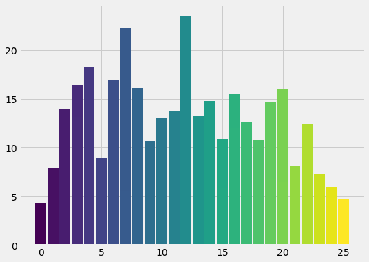
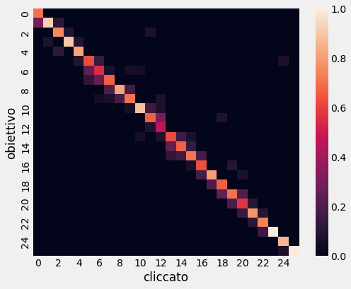

# Introduzione

La visualizzazione è un aspetto fondamentale quando si vogliono presentare dei dati ad un pubblico al fine di comunicare delle relazioni complesse in modo semplice. Hans Rosling fu un pioniere della data visualization, nelle sue presentazioni era solito usare delle rappresentazioni animate per rappresentare questioni legate allo sviluppo umano nei Paesi del mondo. Nel fare ciò era solito utilizzare dei bubble plot animati nel tempo. 

In un bubble plot si visualizza una collezione di dati utilizzando un piano cartesiano: in esso vengono collocati dei punti, per ciascuno di essi la posizione sull'asse orizzontale è determinata da una variabile, così come la posizione sull'asse verticale, altre variabili vengono rappresentate usando le dimensioni colore e taglia dei punti. Per rappresentare le variabili in funzione del tempo risulta pratico ed efficace realizzare dei bubble plot animati, dove frame dopo frame si mostra la progressione dei dati al variare del tempo.

Queste visualizzazioni sono intrinsecamente molto efficaci nel comunicare le informazioni espresse nei dati, e sono pensate per contribuire ad una visione di insieme. Per questo motivo può risultare difficile seguire un singolo punto nel suo percorso sul piano, a meno di non introdurre un highlight di qualche tipo. 

In questo progetto abbiamo investigato i possibili vantaggi provenienti dall'impiego del suono per evidenziare un punto nel plot. Abbiamo ipotizzato che la sonificazione possa aiutare ad individuare e seguire un punto di riferimento nella rappresentazione visuale.

# Metodo

Per trattare questa ipotesi abbiamo realizzato una simulazione in Processing di un bubble plot animato, con la possibilità di riprodurre un highlight sonoro (i dettagli implementativi verranno discussi in seguito). Le scene realizzate con questa simulazione sono state impiegate per svolgere degli esperimenti con dei soggetti, al fine di valutare gli effetti della sonification.

## Rappresentazione visuale

Per ciascuna scena simulata sono stati generati dei punti che si muovono all'interno di un'area quadrata. La dimensione di un punto è generata in modo casuale all'interno di un intervallo di valori, mentre il colore è ricavato dalla mappa di colore Viridis, ad ogni punto corrisponde uno specifico colore.

La scelta della scala Viridis è stata dettata principalmente dalle sue caratteristiche: robustezza, uniformità e popolarità. Il numero dei punti (e di conseguenza dei colori), è stato scelto in modo da rendere non immediata la distinzione dei punti dal colore simile. Abbiamo impiegato un numero di campioni superiore a quello che normalmente consente una distinzione chiara anche su dei glifi piccoli, così facendo abbiamo coinvolto un numero di livelli sufficiente ad introdurre una certa confusione tra i colori, pur permettendo la discriminazione dell'obiettivo confrontando i soli colori. Dopo un certo numero di prove preliminari abbiamo individuato in 27 punti un buon compromesso.

Per simulare quanto accade nei bubble plot, abbiamo affiancato all'area quadrata una leggenda. In questa è resa nota la corrispondenza per ogni punto tra la sua etichetta ed il suo colore. Le etichette consistono di semplici numeri incrementali che partono da zero, mentre i colori corrispondono alla sequenza dei campioni ricavati dalla mappa di colore.

Per ogni scena è estratto in maniera random un punto che funge da target, ovvero il punto sul quale vorremmo che sia rivolta l'attenzione. Esso è reso noto tramite un'istruzione posta sotto la leggenda.

## Sonification

Trattandosi di un bubble plot animato, la scelta sulla proprietà da sonificare è ricaduta sulla la velocità del target: il suono è generato a partire da un accordo (ad un punto fermo corrisponde un accordo di Do maggiore, con fondamentale a 32.7 Hz), dove il pitch sale al crescere della velocità del target. Per una data velocità ricaviamo un offset, che è usato come coefficiente da moltiplicare alle frequenze di base dell'accordo, la mappatura è fatta in modo da spaziare all'interno di un'ottava. Questa scelta è stata fatta in seguito a delle prove preliminari, cercando una buona rappresentatività del suono. 

Il suono è sintetizzato impiegando degli oscillatori sinusoidali, il segnale risultante è filtrato con un filtro passa basso, la cui frequenza di taglio è ricavata sempre dalla velocità del target: ad una bassa velocità corrisponde un suono poco brillante, ad un'alta velocità corrisponde un suono più brillante. Agli oscillatori abbiamo aggiunto un leggero pink noise di fondo per garantire una gamma di frequenze abbastanza vasta, per apprezzare bene le variazioni in brillantezza del suono. Questa sintesi sonora prende spunto da quanto fatto da Niklas Rönnberg [1].

Abbiamo anche realizzato una variazione di questa sonificazione, che funziona esattamente come prima per quanto riguarda la velocità, ma che introduce un leggero suono di "bump" in caso di variazioni drastiche della traiettoria del punto.

## Movimento

Il moto di ciascun punto è casuale, ma strutturato in modo che in un intervallo di tempo circoscritto ricalchi un movimento plausibile per un elemento in un bubble plot animato. I punti sono trattenuti all'interno del box, in caso di avvicinamento e contatto con i bordi la traiettoria è deviata per mantenere i punti entro i limiti. A queste variazioni di direzione non corrisponde un bump in quanto si tratta di variazioni artificiali che non si presentano nei bubble plot, la loro sonificazione potrebbe risultare fuorviante.

## Partecipanti 

Ai nostri esperimenti hanno preso parte XX partecipanti (X femmine e XX maschi) con un'età media di XX anni (range XX-XX) con normali capacità di vista e udito. I partecipanti erano tutti nostri conoscenti. Non è stato fornito alcun compenso per la partecipazione allo studio.

## Esperimenti

Ogni partecipante ha svolto la sua sessione in circostanze ambientali confrontabili, per quanto riguarda aspetti come illuminazione ambientale e rumore di fondo. Abbiamo utilizzato due computer portatili, entrambi con un monitor full hd da 14 pollici, utilizzando come dispositivo di puntamento un mouse esterno. Per la riproduzione sonora abbiamo impiegato gli altoparlanti integrati nei portatili, ci siamo accertati che entrambi riproducessero la banda di frequenze coinvolta in modo adeguato.

Ogni partecipante è stato sottoposto ad una sessione fatta da più tentativi, ciascuno dei quali in una scena diversa. Abbiamo chiesto ai partecipanti di provare ad individuare il target nel minor tempo possibile, cliccando con il cursore sul punto corrispondente.

Le diverse scene possono differire per il livello di sonification, infatti una scena può presentare o meno l'highlight sonoro del target. Alla luce di ciò, i livelli della variabile highlight sonoro sono:

\vspace{-6pt}

+ nessuna sonification (\textbf{n}), 
+ sonification della velocità (\textbf{s}),
+ sonification della velocità e bump (\textbf{b}). 

Ogni partecipante esegue 12 tentativi per ciascun livello, per un totale di 39 prove. Il livello di sonification presentato ad ogni trial è casuale, quest'aspetto è fondamentale per compensare gli effetti d'ordine. Inoltre bisogna considerare l'apprendimento, infatti è molto probabile che i partecipanti facciano sensibilmente peggio nei primi tentativi, per circoscrivere gli effetti del learning i partecipanti effettuano una sessione di allenamento preliminare: primi 9 tentativi comprendono uno stesso numero di trial per ciascuna modalità e vengono esclusi dalla raccolta dei dati.

Abbiamo chiesto ai partecipanti di fornire le risposte nel minor tempo possibile, per ogni risposta abbiamo tenuto traccia del livello di sonificazione, dell'accuratezza e del tempo di risposta, di taglia e colore per i due punti di interesse (il target e il selezionato). Per accuratezza intendiamo l'errore tra il colore del punto selezionato e quello del punto obiettivo, ossia la loro distanza nella scala Viridis. Dopodiché, per ciascun partecipante, abbiamo ricavato l'accuratezza media e il tempo medio per le tre condizione di test. Dato che l'accuratezza è calcolata con una misura di distanza, si ha accuratezza massima quando la distanza è pari a zero, ovvero quando si è selezionato correttamente l'obiettivo.

# Risultati 

## Accuratezza

Qui di seguito riportiamo l'accuratezza media per ciascuna delle condizioni d'analisi, con i relativi intervalli di confidenza al 95%:

\vspace{-6pt}

- n: 5.88, [4.23, 7.34] 
- s: 10.67, [8.23, 12.35] 
- b: 12.40, [10.23, 14.44]
    

Abbiamo verificato l'ipotesi di differenza nulla tra le medie utilizzando il test statistico ANOVA a misure ripetute, sul singolo fattore sonification. L'esito del test ci ha portato a rigettare l'ipotesi nulla, in quanto abbiamo ottenuto un p-value < 0.05. Facendo dei contronti a coppie con un t-test corretto con Bonferroni ha rivelato una differenza significativa tra ... e ....

## Tempo

Qui di seguito riportiamo il tempo medio per ciascuna delle condizioni d'analisi, con i relativi intervalli di confidenza al 95%:

\vspace{-6pt}

- n: 5.88, [4.23, 7.34] 
- s: 10.67, [8.23, 12.35] 
- b: 12.40, [10.23, 14.44]

Abbiamo eseguito lo stesso test di prima per verificare la rigettibilità dell'ipotesi nulla di nessuna differenza tra i tempi di esecuzione, il test ha restituito un p-value < 0.05, il che ci porta a dire che possiamo rigettare l'ipotesi nulla. Dai confronti a coppie si nota che esiste una differenza significativa tra ... e ..., e tra ... e ....

<!--

-->

## Colore

Abbiamo pensato che potesse esistere qualche effetto in funzione del colore dei punti, effettivamente

## Taglia

# Considerazioni

Duis exercitation nostrud tempor nisi magna consectetur anim. Pariatur fugiat voluptate consectetur ea eu dolor excepteur. Voluptate tempor aliquip reprehenderit non minim laborum Lorem ad est irure qui consequat esse. Velit aliquip exercitation amet ex. Officia veniam ullamco labore quis culpa adipisicing minim in veniam magna ullamco no.

# Fonti 

1. Materiale didattico del corso Multisensory and Data Exploration - Davide Rocchesso a.a. 20/21
2. Niklas Rönnberg - Musical sonification supports visual discrimination of color intensity
3. Niklas Rönnberg - Sonification supports perception of brightness contrast
4. Hans Rosling 

